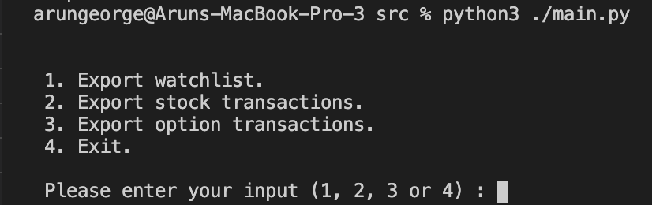

# MyRobinhoodData

A wrapper around Robinhood API calls to export your watchlist, options history, and stocks order history to JSON, HTML, or XLS files. This also creates a summary data for your options and stock transactions. *** Summary feature is very basic as of now, and there are issues/bugs which I will fix in the coming days. Feel free to create new issues ***

## Getting Started

### Setting up the project

Download the repo/code to a folder on your laptop via the green code button. Install the dependencies listed in `requirements.txt.`

```sh
pip install -r requirements.txt
```

### Obtaining and saving your Robinhood API token

1. Login to Robinhood on your browser.
2. Right click the page and click "Inspect". This will open up your developer console.
3. Now in the developer console, open the Network tab and search for "orders".
4. Select the first option and scroll down until you see a section titled "Request Headers".


_You'll need the full text of that authorization section. It's blacked out here for privacy._

5. Copy everything that appears after "Bearer" to your clipboard. This is your API bearer token.
6. Paste the token into `token.example.txt`. Rename the file to `token.txt`. `.gitignore` has this file ignored for your privacy to prevent it from being committed to the repo.

Alternatively, instead of saving your token to `token.txt`, you can pass in this string when initializing the RHDataCollector class:

Open the file rh_data_collector.py and replace line 16

```py
def __init__(self):
        self.rhApihelper = RHApiHelper("YOUR TOKEN HERE")
```

## Running the project

`src/rh_data_collector.py` is set up to export your watchlist, options history, and stocks order history to HTML or XLS files. `src/main.py` is all set up for you to export all three to XLS. Whether you're exporting as HTML or XLS, JSON files for the paginated API collection data will also be generated.

To run the code:

```sh
python src/main.py
```



1. Enter 1 to export your watchlist
2. Enter 2 to export your stock transactions and summary
3. Enter 3 to export your option transactions and summary
4. Enter 4 to exit

